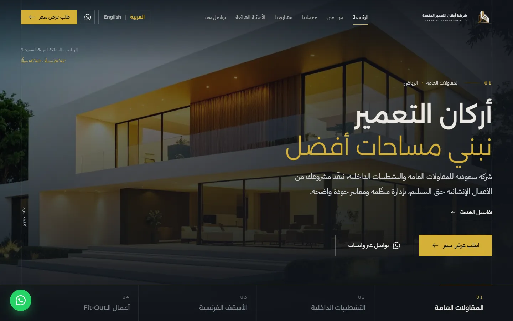
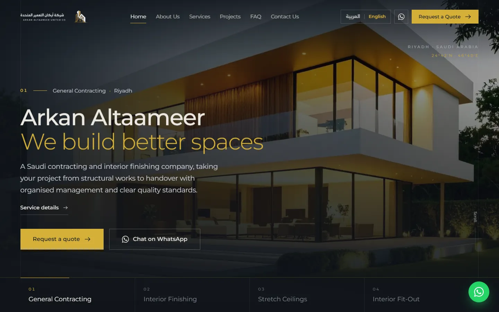
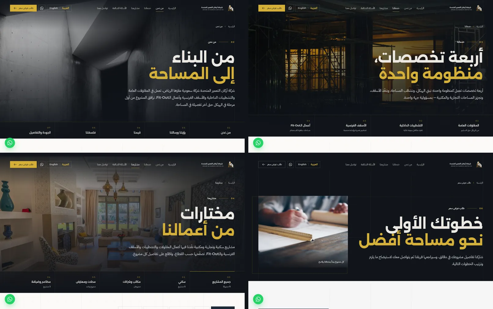
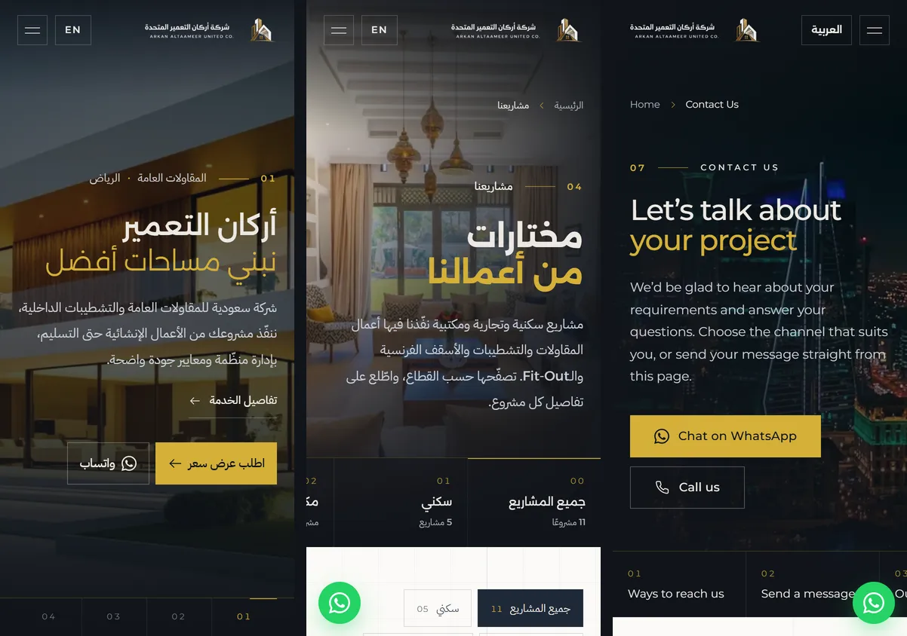

<div align="center">

<picture>
  <source media="(prefers-color-scheme: dark)" srcset="public/brand/logo-on-dark.webp" />
  
</picture>

# Arkan Altaameer United Co. — Website

**Bilingual corporate website for a Riyadh-based general contracting and interior finishing company.**<br />
Arabic (RTL) and English (LTR) · premium architectural design · built for speed.

[](https://github.com/zain-mo1/arkan-altaameer/actions/workflows/ci.yml)


**[Live site](https://arkan-altaameer.vercel.app)** · [English version](https://arkan-altaameer.vercel.app/en/)

</div>



## Overview

Arkan Altaameer United Co. delivers **general contracting, interior finishing, stretch ceilings and interior
fit-out** for residential and commercial clients in Saudi Arabia. This repository contains the company website:
a fully bilingual, static React application with an architectural design language ("from structure to space"),
editorial motion and a strong focus on performance, accessibility and conversion through WhatsApp.

### Highlights

- **Two languages, written natively** — Arabic at `/` (right-to-left) and English at `/en/` (left-to-right). Every
  page, form, validation message and piece of UI is translated, and the copy is written for each audience rather
  than translated word for word.
- **Nine pages** — Home, About Us, Services, Projects, FAQ, Request a Quote, Contact Us, Privacy Policy and Terms &
  Conditions, plus a 404 page.
- **Architectural design system** — a drafting-sheet motif (grid, sheet numbers, title blocks, a gold seam),
  brand typography (Alexandria, IBM Plex Sans Arabic, Montserrat) and restrained, purposeful motion.
- **Conversion-first** — WhatsApp everywhere it helps (header, hero, services, projects, contact, footer and a
  floating button), with **pre-filled messages that match the page, service or project** being viewed.
- **Forms without a backend** — contact and quote-request forms validate input and hand off a structured message to
  WhatsApp or e-mail; point them at any form endpoint to post directly and enable file uploads.
- **SEO basics built in** — a static HTML file per page and language with its own title, description, canonical
  URL, `hreflang` alternates and Open Graph tags, plus `sitemap.xml`, `robots.txt` and JSON-LD.
- **Fast by default** — code-split pages, responsive AVIF/WebP images with blurred placeholders, preloaded hero
  images and fonts, and animation limited to transforms and opacity.
- **Accessible** — semantic landmarks, one `h1` per page, keyboard-friendly menus, dialogs and forms, visible focus
  states and full support for `prefers-reduced-motion`.

## Screenshots

<table>
  <tr>
    <td width="50%"></td>
    <td width="50%"></td>
  </tr>
</table>

<p align="center"></p>

## Pages

| Page               | Arabic (RTL) | English (LTR)  | Notes                                                               |
| ------------------ | ------------ | -------------- | ------------------------------------------------------------------- |
| Home               | `/`          | `/en/`         | Service slideshow hero, about, services, projects, process, CTA     |
| About Us           | `/about`     | `/en/about`    | Company profile, vision & mission, values, philosophy, quality      |
| Services           | `/services`  | `/en/services` | One chapter per service; deep link with `#contracting`, `#ceiling`… |
| Projects           | `/projects`  | `/en/projects` | Sector filters and a project viewer (`?project=<slug>`)             |
| FAQ                | `/faq`       | `/en/faq`      | 30 answers in 8 topics, with Arabic-aware search                    |
| Request a Quote    | `/quote`     | `/en/quote`    | Three-part form, pre-filled from `?service=` or `?project=`         |
| Contact Us         | `/contact`   | `/en/contact`  | Channels, contact form, location panel                              |
| Privacy Policy     | `/privacy`   | `/en/privacy`  |                                                                     |
| Terms & Conditions | `/terms`     | `/en/terms`    |                                                                     |

## Tech stack

| Area      | Choice                                                                                   |
| --------- | ---------------------------------------------------------------------------------------- |
| Framework | React 19 with React Router 8 (data router, lazy-loaded pages)                            |
| Tooling   | Vite 8 (Rolldown), TypeScript (strict), oxlint, Prettier with Tailwind class sorting     |
| Styling   | Tailwind CSS 4 — design tokens in `@theme`, logical properties for automatic RTL / LTR   |
| Motion    | Framer Motion 13 (lazy DOM features), Lenis smooth scrolling                             |
| Fonts     | Self-hosted via Fontsource: Alexandria, IBM Plex Sans Arabic (Arabic subset), Montserrat |
| Images    | `sharp` pipeline producing responsive AVIF + WebP sets and a typed media manifest        |

## Getting started

**Requirements:** Node.js 20.19+ (22 LTS recommended — see [`.nvmrc`](.nvmrc)) and npm.

```bash
git clone https://github.com/zain-mo1/arkan-altaameer.git
cd arkan-altaameer
npm install
npm run dev
```

Open <http://localhost:5173> for Arabic or <http://localhost:5173/en/> for English.

### Scripts

| Command                  | Description                                                           |
| ------------------------ | --------------------------------------------------------------------- |
| `npm run dev`            | Start the development server with hot reload                          |
| `npm run build`          | Type-check and build the production site into `dist/`                 |
| `npm run preview`        | Serve the production build locally                                    |
| `npm run check`          | Lint, type-check and verify formatting (what CI runs before building) |
| `npm run lint`           | Lint with oxlint                                                      |
| `npm run format`         | Format with Prettier (including Tailwind class order)                 |
| `npm run media`          | Regenerate responsive images from `assets/photos` (see below)         |
| `npm run build:artifact` | Build a self-contained static preview into `.artifact/`               |

## Project structure

```text
src/
├── app/              router (lazy pages), layout shell, page transition, providers
├── components/
│   ├── layout/       header, mobile menu, language switch, footer, floating WhatsApp button
│   ├── page/         page hero, sections, headings, title blocks, framed images, breadcrumbs
│   ├── sections/     home-page sections (Process, ContactCta, StructureToSpace are shared)
│   ├── forms/        field primitives, file drop, form actions, result states
│   ├── projects/     project card
│   ├── faq/          accordion
│   └── ui/           picture, buttons, headings, reveals, icons
├── config/           company facts (site.ts) and the page registry (pages.ts)
├── data/             services, projects, FAQ, navigation, generated media manifest
├── hooks/            document meta, current page, section navigation, scroll helpers
├── i18n/             Arabic and English dictionaries, language context, path helpers
├── lib/              links, form delivery and validation, search, motion constants
├── pages/            Home, NotFound and one folder per inner page (page, sections, copy)
└── styles/           design tokens, typography, textures
scripts/              media pipeline and static preview build
assets/               source photography and brand files (not served directly)
public/               generated media, logos, favicons, web manifest
```

## Editing content

No CMS is needed — content lives in typed files, so a missing translation fails the build.

| What                                                         | Where                              |
| ------------------------------------------------------------ | ---------------------------------- |
| Company facts: phone, WhatsApp, e-mail, domain, social links | `src/config/site.ts`               |
| Page paths, titles and meta descriptions                     | `src/config/pages.ts`              |
| Shared interface copy (navigation, buttons, forms, home)     | `src/i18n/ar.ts`, `src/i18n/en.ts` |
| Services and the home-page hero slides                       | `src/data/services.ts`             |
| Services page (scope, benefits, finishes, sectors)           | `src/pages/services/content.ts`    |
| Projects and project categories                              | `src/data/projects.ts`             |
| Frequently asked questions                                   | `src/data/faq.ts`                  |
| Page copy (About, Contact, Quote, FAQ, Projects)             | `src/pages/<page>/content.ts`      |
| Privacy Policy and Terms & Conditions                        | `src/pages/legal/*-content.ts`     |

### Photos

Source photos live in `assets/photos/<key>.jpg` and are registered in
[`scripts/media.config.mjs`](scripts/media.config.mjs) with a responsive preset, an optional crop and a focal point.
`npm run media` writes the responsive files to `public/media/` and a typed manifest to
`src/data/media.generated.ts`; components then use `<Picture id="<key>" … />`, and a mistyped key is a type error.
It also renders the link-preview cards in `public/og/` from the photos listed in `SHARE_CARDS`.

**Adding a project:** add `assets/photos/prj-<name>.jpg`, register it in `scripts/media.config.mjs`, run
`npm run media`, then add an entry to `src/data/projects.ts`.

## Forms and WhatsApp

- **Without an endpoint (default):** the contact and quote forms validate the input, then compose a structured
  message that opens in WhatsApp — or in the visitor's e-mail app. Visitors are invited to share drawings or photos
  in the WhatsApp chat.
- **With an endpoint:** set `site.forms.endpoint` to any service that accepts `multipart/form-data` (Formspree,
  Web3Forms, Basin or your own API). The forms then post directly, show success and error states, and the quote
  form accepts drag-and-drop attachments (PDF and images; limits in `site.forms`).

WhatsApp messages are chosen per page, per service and per project; they live under `wa` in the dictionaries.

## SEO

At build time [`vite.config.ts`](vite.config.ts) writes a static HTML file for every page in both languages
(`about/index.html` and `about.html`, and so on), each with its own title, description, canonical URL, `hreflang`
alternates (Arabic, English, `x-default`) and Open Graph tags, and preloads that page's hero image and code
chunk. It also generates `sitemap.xml`, `robots.txt` and a `noindex` `404.html`; the home page carries JSON-LD
(`GeneralContractor`). Client-side navigation keeps the same tags in sync.

**Link previews:** when a page is shared on WhatsApp, LinkedIn, X or Facebook, the preview shows that page's own
card (its hero photo, a gold frame and the logo, 1200 × 630) with its title and description. Pages without a hero
photo use the home card, and the build fails if a card is missing.

## Deployment

The site is fully static — deploy the `dist/` folder to any static host (Netlify, Vercel, Cloudflare Pages, GitHub
Pages, S3 + CloudFront…). Clean URLs resolve to the generated HTML files, and unknown paths should fall back to
`404.html` (the default on most hosts).

Every page has its own HTML file, so **no SPA fallback rewrite is needed** — and adding one (`/(.*)` →
`/index.html`) would turn every mistyped link into a copy of the home page instead of a real 404.

**Vercel:** import the repository and deploy — [`vercel.json`](vercel.json) sets the Vite preset, the `dist/` output
directory and clean URLs, and caches the fingerprinted files in `dist/assets/` for a year, so no dashboard settings
are needed.

Pre-rendering the pages (SSG) is a recommended next step to improve first paint on slow mobile connections.

## Before launch

- [ ] Connect the company domain on Vercel and set it as `url` in `src/config/site.ts` (currently
      `https://arkan-altaameer.vercel.app`).
- [ ] Add the social media profiles, office address and, optionally, working hours and a map embed.
- [ ] Replace the sample projects in `src/data/projects.ts` with the company's real projects and photography.
- [ ] Replace the placeholder photography in `assets/photos/` and re-run `npm run media`.
- [ ] Confirm the scope lists in `src/pages/services/content.ts` and `src/data/services.ts`.
- [ ] Have the Privacy Policy and Terms & Conditions reviewed by the company's legal adviser.
- [ ] Optionally connect a form endpoint (`site.forms.endpoint`) to receive requests and attachments by e-mail.

## Credits

Placeholder photography is from [Unsplash](https://unsplash.com) under the
[Unsplash License](https://unsplash.com/license); see [`assets/photos/CREDITS.md`](assets/photos/CREDITS.md).
Brand identity, logos and name belong to Arkan Altaameer United Co.

## License

This is a proprietary client project. The source code, content and brand assets are not licensed for reuse,
modification or redistribution without written permission.
